<!-- Improved compatibility of back to top link: See: https://github.com/othneildrew/Best-README-Template/pull/73 -->
<a id="readme-top"></a>
<!--
*** Thanks for checking out the Best-README-Template. If you have a suggestion
*** that would make this better, please fork the repo and create a pull request
*** or simply open an issue with the tag "enhancement".
*** Don't forget to give the project a star!
*** Thanks again! Now go create something AMAZING! :D
-->

<!-- PROJECT SHIELDS -->
<!--
*** I'm using markdown "reference style" links for readability.
*** Reference links are enclosed in brackets [ ] instead of parentheses ( ).
*** See the bottom of this document for the declaration of the reference variables
*** for contributors-url, forks-url, etc. This is an optional, concise syntax you may use.
*** https://www.markdownguide.org/basic-syntax/#reference-style-links
-->

<!-- [![Contributors][contributors-shield]][contributors-url] -->
[![LinkedIn][linkedin-shield]][linkedin-url]
[![Forks][forks-shield]][forks-url]
[![Stargazers][stars-shield]][stars-url]
[![Issues][issues-shield]][issues-url]
[![MIT License][license-shield]][license-url]

<!-- PROJECT LOGO -->
<br />
<div align="center">
  <a href="https://github.com/github_username/repo_name">
    
  </a>

<h3 align="center">OneSocial</h3>

  <p align="center">
    Made by: Pierre Mvita
    <br />
    Date: 01/2025
    <br />
    <a href="https://github.com/github_username/repo_name"><strong>Explore the docs »</strong></a>
    <br />
    <br />
    <a href="https://github.com/github_username/repo_name">View Demo</a>
    ·
    <a href="https://github.com/github_username/repo_name/issues/new?labels=bug&template=bug-report---.md">Report Bug</a>
    ·
    <a href="https://github.com/github_username/repo_name/issues/new?labels=enhancement&template=feature-request---.md">Request Feature</a>
  </p>
</div>

<!-- TABLE OF CONTENTS -->
<details>
  <summary>Table of Contents</summary>
  <ol>
    <li>
      <a href="#about-the-project">About The Project</a>
      <ul>
        <li><a href="#built-with">Built With</a></li>
      </ul>
    </li>
    <li>
      <a href="#getting-started">Getting Started</a>
      <ul>
        <li><a href="#prerequisites">Prerequisites</a></li>
        <li><a href="#installation">Installation</a></li>
      </ul>
    </li>
    <li><a href="#usage">Usage</a></li>
    <li><a href="#roadmap">Roadmap</a></li>
    <li><a href="#contributing">Contributing</a></li>
    <li><a href="#license">License</a></li>
    <li><a href="#contact">Contact</a></li>
    <li><a href="#acknowledgments">Acknowledgments</a></li>
  </ol>
</details>

<!-- ABOUT THE PROJECT -->
## About The Project

[![Product Name Screen Shot][product-screenshot]](https://example.com)

This project is a cross-platform Social media, messaging, and crypto wallet app built using React Native and Expo. It features:

- Full authentication system using Supabase
- Real-time messaging capabilities
- Integrated crypto wallet functionality
- Customizable user profiles
- Dark/Light theme support
- Animated UI components
- Cross-platform compatibility (iOS & Android)
- Accessibility features
- Push notifications

Recent Updates:
- Added theme context for dynamic theming
- Implemented animated feed components
- Enhanced accessibility with ARIA labels and roles
- Added profile image handling
- Improved post interaction UI
- Added real-time updates for posts and messages

<p align="right">(<a href="#readme-top">back to top</a>)</p>

### Built With

* [![React][React.js]][React-url]
* [![ReactNative][ReactNative.js]][ReactNative-url]
* [![Expo][Expo.io]][Expo-url]
* [![Supabase][Supabase.io]][Supabase-url]

<p align="right">(<a href="#readme-top">back to top</a>)</p>

<!-- GETTING STARTED -->
## Getting Started

To get a local copy up and running follow these simple example steps.

### Prerequisites

* Node.js
  ```sh
  node -v
  ```
* npm
  ```sh
  npm install npm@latest -g
  ```
* Yarn
  ```sh
  yarn -v
  ```

### Installation

1. Clone the repo
   ```sh
   git clone https://github.com/Pmvita/OneSocial-supabase.git
   ```
2. Install Yarn packages
   ```sh
   yarn install
   ```
3. Change git remote url to avoid accidental pushes to base project
   ```sh
   git remote set-url origin github_username/repo_name
   git remote -v # confirm the changes
   ```
4. Configure environment variables:
   - Create a `.env` file in the root directory
   - Add your Supabase configuration:
     ```
     SUPABASE_URL=your_supabase_url
     SUPABASE_ANON_KEY=your_anon_key
     ```
5. Start the app
   ```sh
   yarn start
   ```

<p align="right">(<a href="#readme-top">back to top</a>)</p>

<!-- USAGE EXAMPLES -->
## Usage

<div align="center">
  <table>
    <tr>
      <td>
        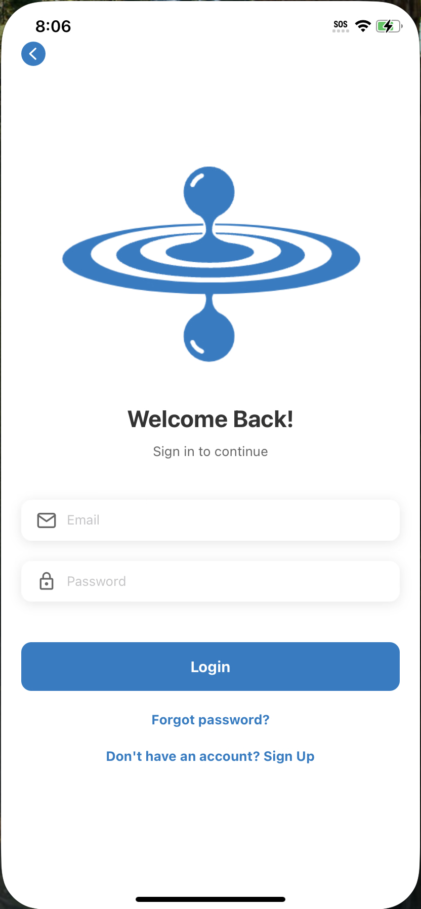
        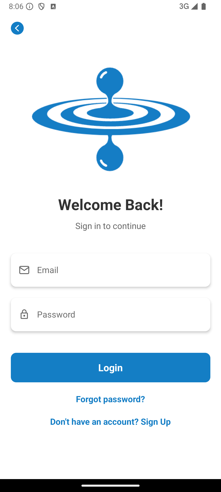
      </td>
      <td>
        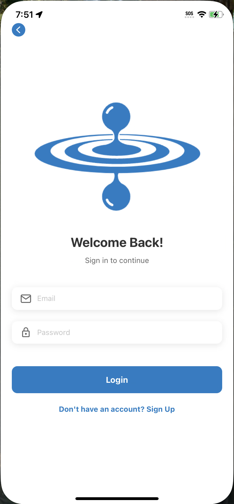
        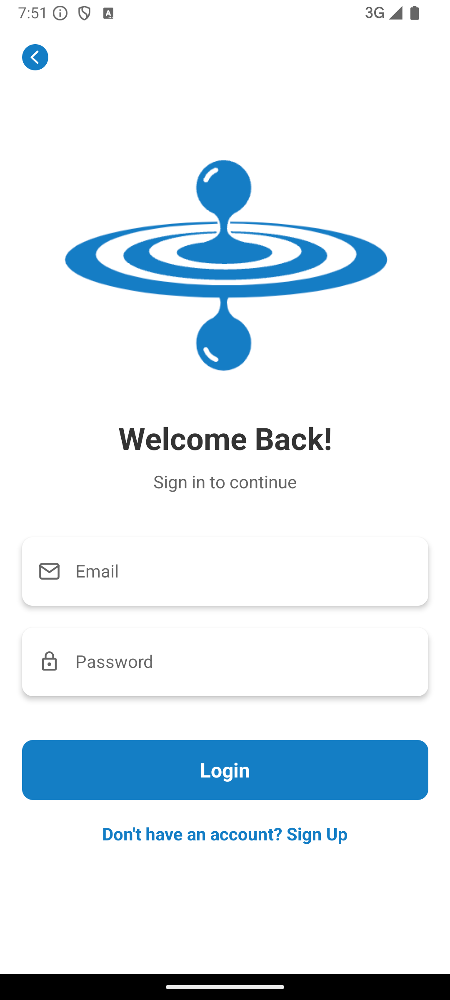
      </td>
      <td>
        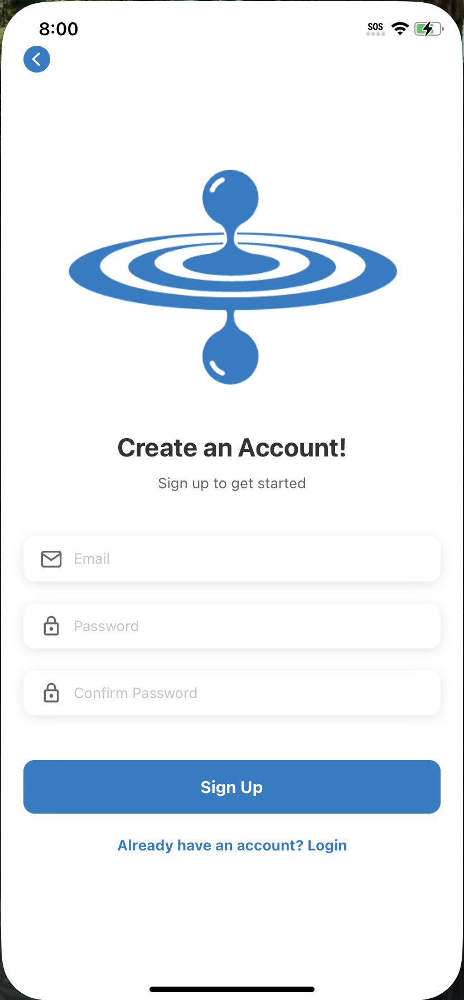
        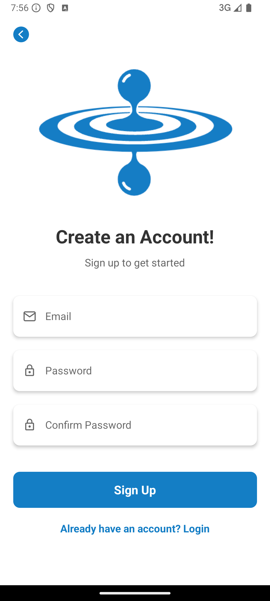
      </td>
      <td>
        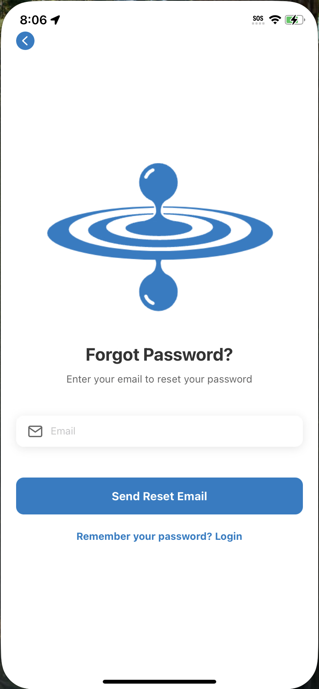
        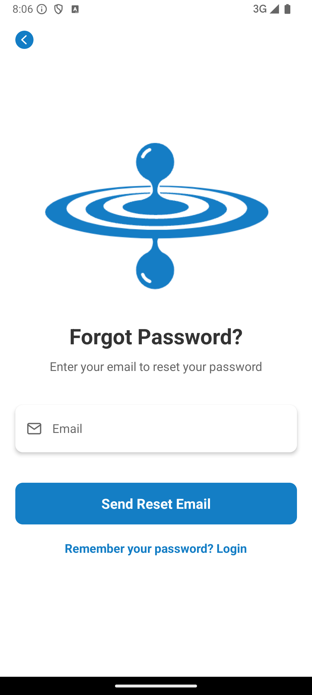
      </td>
    </tr>
    <tr>
      <td>
        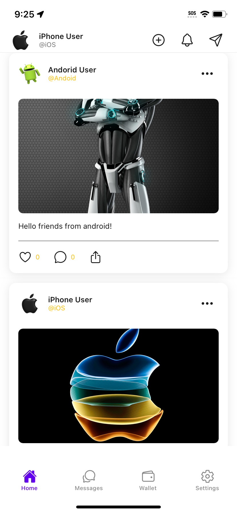
        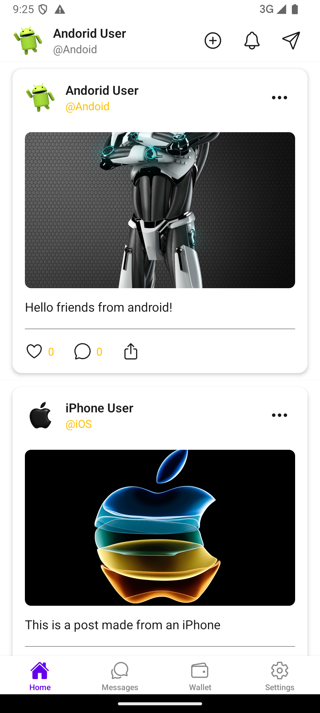
      </td>
      <td>
        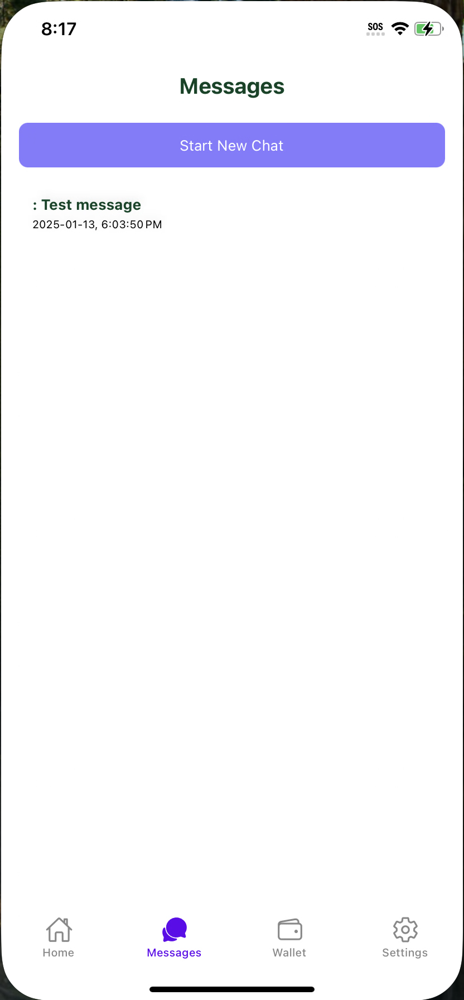
        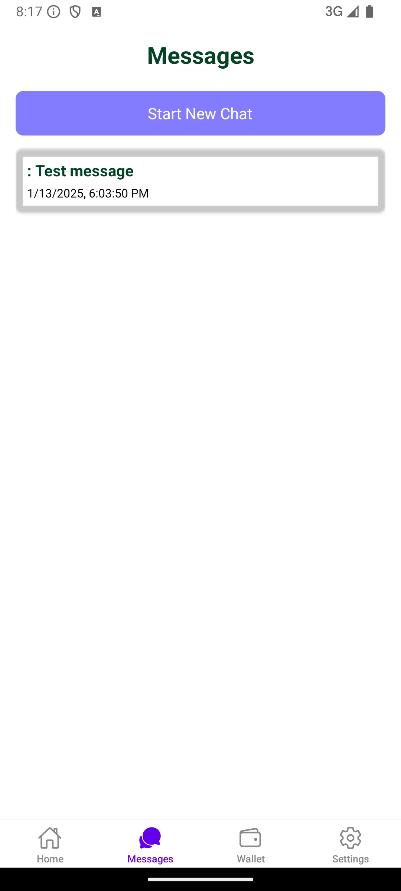
      </td>
      <td>
        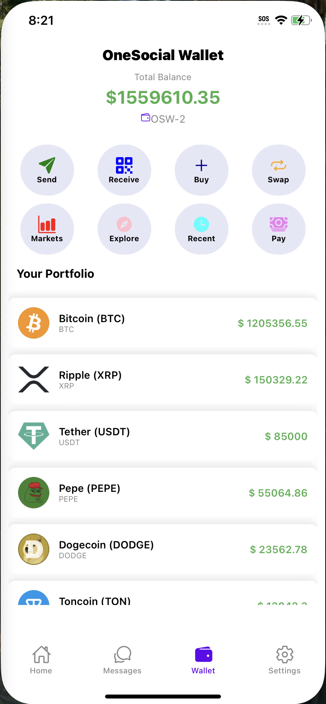
        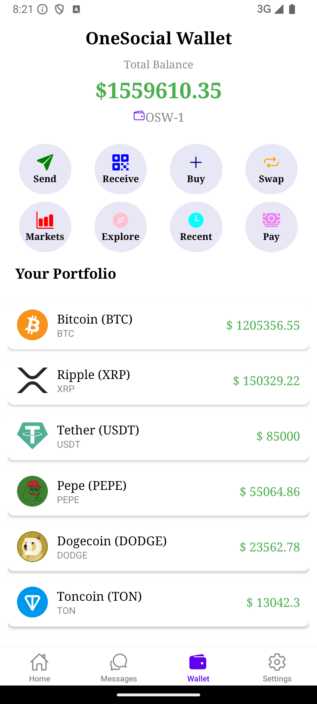
      </td>
      <td>
        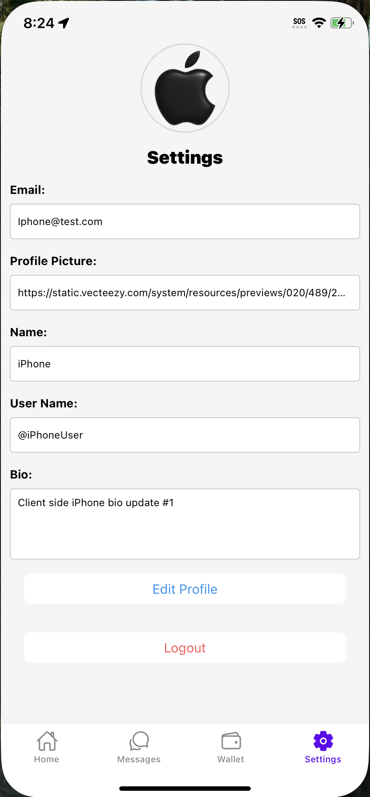
        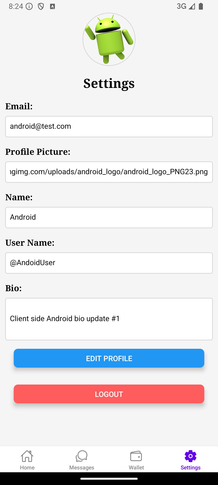
      </td>
    </tr>
  </table>
</div>

_For more examples, please refer to the [Documentation](https://example.com)_

<p align="right">(<a href="#readme-top">back to top</a>)</p>

<!-- ROADMAP -->
## Roadmap

- [x] **Feature 1**: *Authentication*
  - Implemented Supabase email and password authentication
  - Added social authentication options
  - Secure session management
- [x] **Feature 2**: *Real-time Database*
  - Real-time updates for posts and messages
  - Optimistic UI updates
  - Offline data persistence
- [x] **Feature 3**: *Crypto Wallet*
  - Integrated wallet functionality
  - Real-time balance updates
  - Transaction history
  - Secure storage
- [x] **Feature 4**: *Notifications*
  - Push notifications using Expo
  - In-app notifications
  - Custom toast notifications
- [x] **Feature 5**: *Cloud Functions*
  - Serverless functions for complex operations
  - Automated tasks and triggers
- [x] **Feature 6**: *Image Upload*
  - Profile picture upload and management
  - Post image handling
  - Image optimization
- [x] **UI Features**:
  - Implemented React Animated components
  - Added CSS animations & transitions
  - Created custom loader components
  - Designed bottom tab navigation
  - Integrated vector icons
  - Added theme support
  - Enhanced accessibility

See the [open issues](https://github.com/github_username/repo_name/issues) for a full list of proposed features (and known issues).

<p align="right">(<a href="#readme-top">back to top</a>)</p>

<!-- CONTRIBUTING -->
## Contributing

Contributions are what make the open source community such an amazing place to learn, inspire, and create. Any contributions you make are **greatly appreciated**.

If you have a suggestion that would make this better, please fork the repo and create a pull request. You can also simply open an issue with the tag "enhancement".
Don't forget to give the project a star! Thanks again!

1. Fork the Project
2. Create your Feature Branch (`git checkout -b feature/AmazingFeature`)
3. Commit your Changes (`git commit -m 'Add some AmazingFeature'`)
4. Push to the Branch (`git push origin feature/AmazingFeature`)
5. Open a Pull Request

<p align="right">(<a href="#readme-top">back to top</a>)</p>

### Top contributors:

<!-- CONTACT -->
## Contact

Pierre Mvita - [@twitter_handle](https://twitter.com/twitter_handle) - PeterMvita@hotmail.com

Project Link: [https://github.com/Pmvita/OneSocial-supabase.git](https://github.com/Pmvita/OneSocial-supabase.git)

<p align="right">(<a href="#readme-top">back to top</a>)</p>

<!-- ACKNOWLEDGMENTS -->
## Acknowledgments

* [React Native Documentation](https://reactnative.dev/)
* [Expo Documentation](https://docs.expo.dev/)
* [Supabase Documentation](https://supabase.io/docs)

<p align="right">(<a href="#readme-top">back to top</a>)</p>

<!-- MARKDOWN LINKS & IMAGES -->
<!-- https://www.markdownguide.org/basic-syntax/#reference-style-links -->
[contributors-shield]: https://img.shields.io/github/contributors/github_username/repo_name.svg?style=for-the-badge
[contributors-url]: https://github.com/github_username/repo_name/graphs/contributors
[forks-shield]: https://img.shields.io/github/forks/github_username/repo_name.svg?style=for-the-badge
[forks-url]: https://github.com/Pmvita/OneSocial-supabase/forks
[stars-shield]: https://img.shields.io/github/stars/github_username/repo_name.svg?style=for-the-badge
[stars-url]: https://github.com/Pmvita/OneSocial-supabase/stargazers
[issues-shield]: https://img.shields.io/github/issues/github_username/repo_name.svg?style=for-the-badge
[issues-url]: https://github.com/github_username/repo_name/issues
[license-shield]: https://img.shields.io/github/license/github_username/repo_name.svg?style=for-the-badge
[license-url]: https://github.com/Pmvita/OneSocial-supabase/blob/main/LICENSE.txt
[linkedin-shield]: https://img.shields.io/badge/-LinkedIn-black.svg?style=for-the-badge&logo=linkedin&colorB=555
[linkedin-url]: https://www.linkedin.com/in/pierre-mvita/
[product-screenshot]: ./images/title.png
[Next.js]: https://img.shields.io/badge/next.js-000000?style=for-the-badge&logo=nextdotjs&logoColor=white
[Next-url]: https://nextjs.org/
[React.js]: https://img.shields.io/badge/React-20232A?style=for-the-badge&logo=react&logoColor=61DAFB
[React-url]: https://reactjs.org/
[ReactNative.js]: https://img.shields.io/badge/ReactNative-20232A?style=for-the-badge&logo=react&logoColor=61DAFB
[ReactNative-url]: https://reactnative.dev/docs/environment-setup
[Expo.io]: https://img.shields.io/badge/Expo-555555?style=for-the-badge&logo=expo&logoColor=white
[Expo-url]: https://docs.expo.dev/guides/overview/#expo-router
[Supabase.io]: https://img.shields.io/badge/Supabase-00C7B7?style=for-the-badge&logo=supabase&logoColor=white
[Supabase-url]: https://supabase.io
